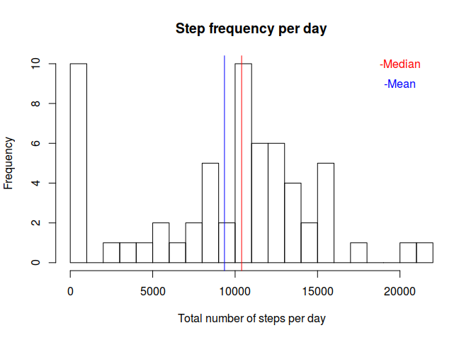
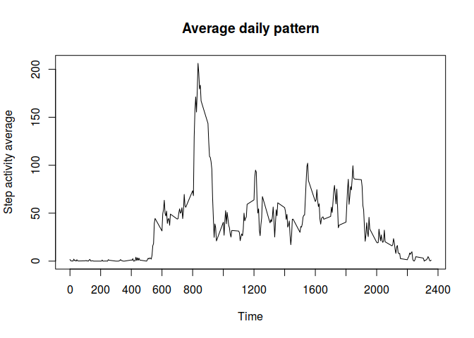
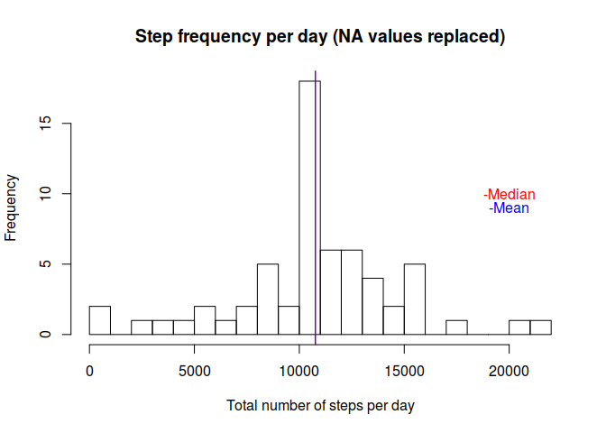
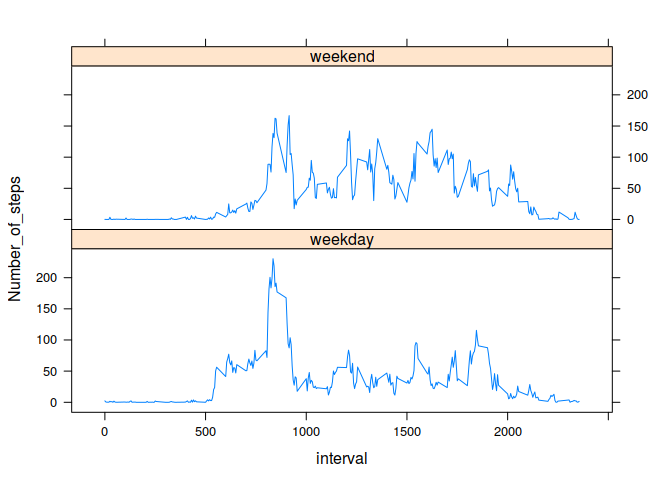

```r
library(readr)
library(dplyr)
library(lubridate)
library(hms)
library(tibble)
library(knitr)
library(lattice)
```
## Loading and preprocessing the data


```r
acti_tbl <- read_csv("activity.zip")
```

```
## 
## ── Column specification ────────────────────────────────────────────────────────
## cols(
##   steps = col_double(),
##   date = col_date(format = ""),
##   interval = col_double()
## )
```


## What is mean total number of steps taken per day?


```r
acti_sum_per_day <- acti_tbl %>%  
                    group_by(date) %>% 
                    summarise(steps = sum(steps, na.rm = TRUE))
hist(acti_sum_per_day$steps, 
     breaks = 20, 
     main = "Step frequency per day",
     xlab = "Total number of steps per day")
step_median = median(acti_sum_per_day$steps)
step_mean = mean(acti_sum_per_day$steps)
abline(v = step_median, col="red")
abline(v = step_mean, col="blue")
text(20000, 10, "-Median", col="red")
text(20000, 9, "-Mean", col="blue")
```

<!-- -->
  
The mean number of steps taken each day is 9354.2295082 and 
the median is 1.0395\times 10^{4}.


## What is the average daily activity pattern?


```r
acti_sum_per_int <- acti_tbl %>%  
                    group_by(interval) %>% 
                    summarise(steps_avg = mean(steps, na.rm = TRUE))
plot(acti_sum_per_int$interval, acti_sum_per_int$steps_avg, 
     type = "l", xaxt = "n", main = "Average daily pattern", 
     xlab = "Time", ylab = "Step activity average")
axis(side=1, at=seq(from = 0, to = 2500, by = 200))
```

<!-- -->

```r
busy_interval <- acti_sum_per_int %>% 
                 slice(which.max(steps_avg)) %>% 
                 select(interval) %>% as.numeric
busy_hour <- as_hms(parse_date_time(busy_interval, orders = "HM"))
busy_hour <- if_else(am(busy_hour), 
                     paste(busy_hour, "AM", sep = " "), 
                     paste(busy_hour, "PM", sep = " "))
```

On average across all the days in the data set, the 835th interval, which correspond to 08:35:00 AM, contains the maximum number of steps.

## Inputing missing values

```r
missing <- acti_tbl %>% filter(is.na(steps)) %>% nrow()
missing_days <- acti_tbl %>% group_by(date) %>% summarise(daily = sum(steps, na.rm = FALSE)) %>% filter(is.na(daily))
```
The total number of missing values in the dataset is 2304.
It correspond to the 8 days listed below.

```r
kable(missing_days[,1], caption = "Days without recorded data")
```


Table: Days without recorded data

|date       |
|:----------|
|2012-10-01 |
|2012-10-08 |
|2012-11-01 |
|2012-11-04 |
|2012-11-09 |
|2012-11-10 |
|2012-11-14 |
|2012-11-30 |
We use the mean of steps per specific interval in order to fill the missing values for those days.

```r
# Join the original data with the interval avg table and use
# this data to replace the NA values when occuring. Stored in no_na column.
acti_no_na <- left_join(acti_tbl, acti_sum_per_int, by = "interval") %>% 
              mutate(no_na = if_else(is.na(steps), steps_avg, steps))

# Recompute the first histogram with this new dataframe
acti_sum_no_na <- acti_no_na %>%  
                  group_by(date) %>% 
                  summarise(steps = sum(no_na, na.rm = TRUE))
hist(acti_sum_no_na$steps, 
     breaks = 20, 
     main = "Step frequency per day (NA values replaced)",
     xlab = "Total number of steps per day")
step_median_no_na = median(acti_sum_no_na$steps)
step_mean_no_na = mean(acti_sum_no_na$steps)
abline(v = step_median_no_na, col="red")
abline(v = step_mean_no_na, col="blue")
text(20000, 10, "-Median", col="red")
text(20000, 9, "-Mean", col="blue")
```

<!-- -->

It appears that replacing the interval missing values by the average value for those intervals induce the mean and the median values of step frequency to converge. There is an increase in frequency in the bucket containing the median of the frequencies. The table below shows the change in values. 

```r
table <- tibble("val" = c("Median", "Mean"),
                "Na excluded" = c(step_median, step_mean), 
                "Na replaced" = c(step_median_no_na, step_mean_no_na))
table <- table %>% column_to_rownames(var = "val")
kable(table, caption = "Change in mean and median according to NA value replacement")
```


Table: Change in mean and median according to NA value replacement

|       | Na excluded| Na replaced|
|:------|-----------:|-----------:|
|Median |    10395.00|    10766.19|
|Mean   |     9354.23|    10766.19|


## Are there differences in activity patterns between weekdays and weekends?


```r
# Add a weekend/weekday factor. Using wday to avoid language issues.
acti_no_na <- acti_no_na %>% 
              mutate(day_type = (if_else(wday(date) %in% c(2:6), "weekday", "weekend")))
acti_no_na <- acti_no_na %>% 
              group_by(day_type, interval) %>%
              summarise(Number_of_steps = mean(no_na))
```

```
## `summarise()` has grouped output by 'day_type'. You can override using the `.groups` argument.
```

```r
# Draw graph
xyplot(Number_of_steps ~ interval | as.factor(day_type), data = acti_no_na, layout = c(1,2), type = "l")
```

<!-- -->

We can see on the graphic that step activity seems to start earlier during the weekdays, but is less pronounced on the afternoon compared to the weekend.


